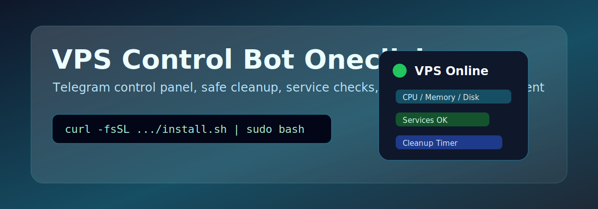
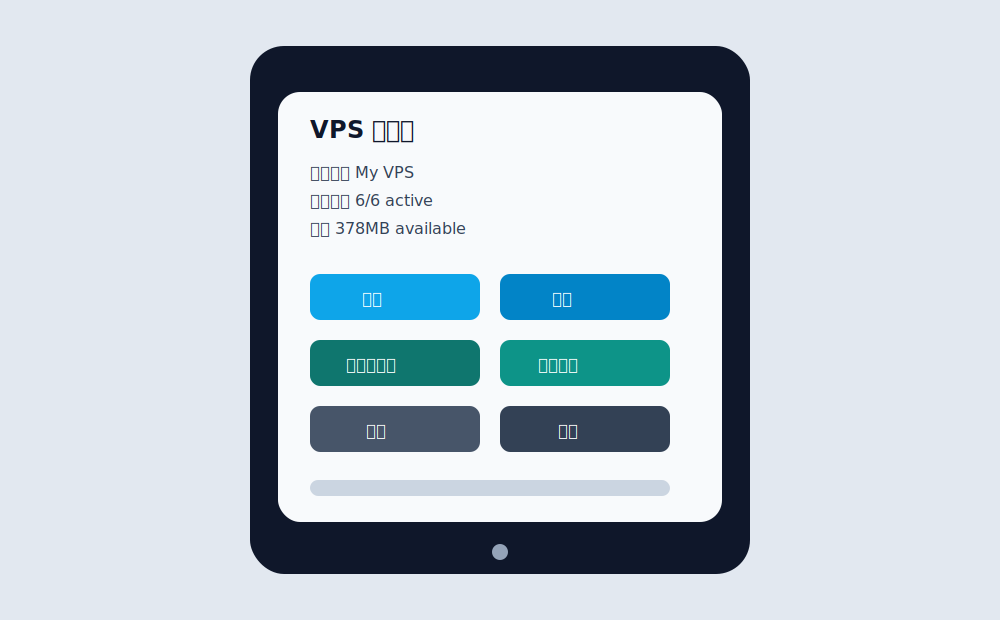
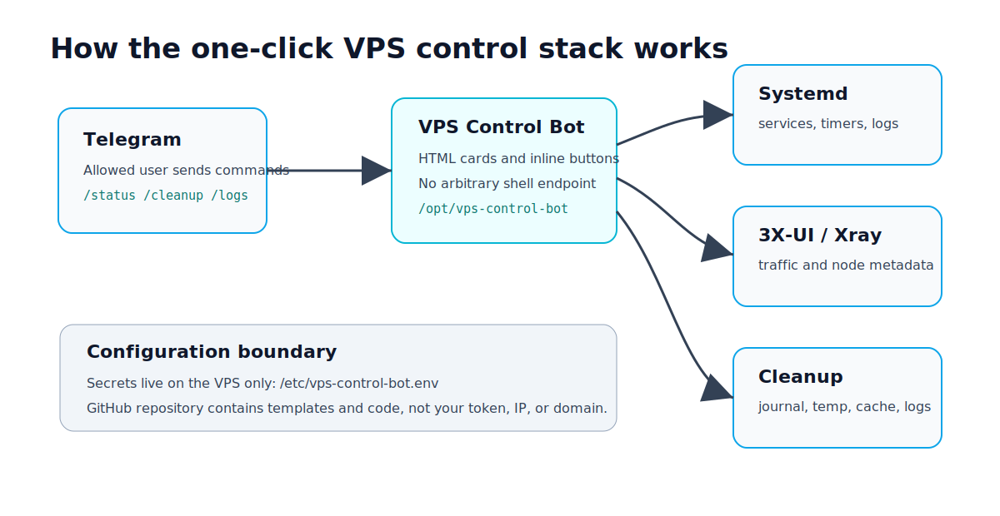
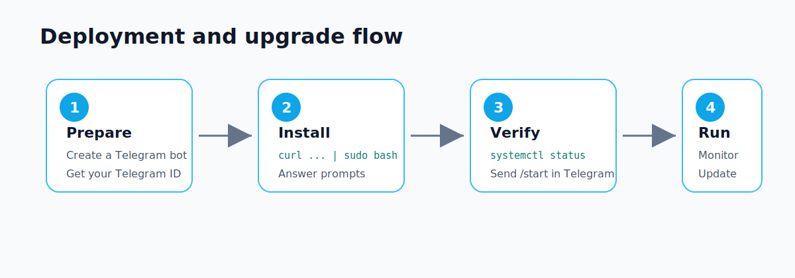

# VPS Control Bot Oneclick



[](LICENSE)
[](install.sh)
[](src/bot.py)
[](systemd/)

Self-hosted Telegram VPS control panel with one-command deployment, safe cleanup, service checks, multilingual docs, and optional 3X-UI / subscription integration.

## Languages

- [简体中文](docs/README.zh-CN.md)
- [English](docs/README.en.md)
- [日本語](docs/README.ja.md)

## Quick Install

```bash
curl -fsSL https://raw.githubusercontent.com/shangguanwt/vps-control-bot-oneclick/main/install.sh | sudo bash
```

The installer asks for your Telegram Bot Token, Telegram user ID allowlist, VPS display name, optional subscription URL, optional health-check URLs, and optional Cloudflare test host.

## Preview



## What It Provides

- Telegram control panel for VPS status, services, traffic, logs, backups, and speed tests
- Optional 3X-UI traffic and subscription display
- Optional Cloudflare best-IP status and VPS-side test
- Hourly safe cleanup timer for journal, cache, temp files, and oversized Docker logs
- Telegram allowlist and confirmation buttons for risky actions
- No arbitrary shell command endpoint

## Architecture



Secrets are stored only on the VPS:

```bash
/etc/vps-control-bot.env
```

## Deployment Flow



## Update

```bash
curl -fsSL https://raw.githubusercontent.com/shangguanwt/vps-control-bot-oneclick/main/install.sh | sudo bash -s -- --update
```

## Uninstall

```bash
curl -fsSL https://raw.githubusercontent.com/shangguanwt/vps-control-bot-oneclick/main/install.sh | sudo bash -s -- --uninstall
```

## Inspired By

This README structure was inspired by the clear deployment-first presentation of [hotyue/IP-Sentinel](https://github.com/hotyue/IP-Sentinel) and its [installation and upgrade guide](https://blog.iot-architect.com/engineering-practice/ip-sentinel-installation-and-upgrade-guide/). The code and installer in this repository are independent and focused on Telegram-based VPS control.

## Security

Do not publish real Bot Tokens, Telegram IDs, VPS IPs, private domains, subscription tokens, or panel paths. The bot does not expose arbitrary shell execution.
